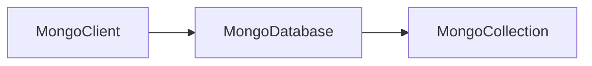
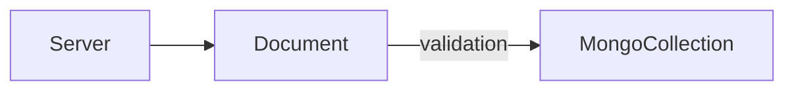
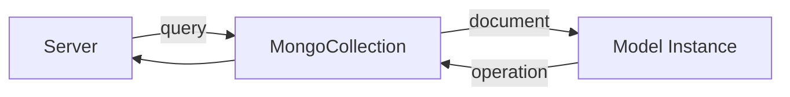

# @neisanworks/neisan-mongo

A schema-safe, Zod-powered MongoDB driver with class-modeling, functional querying, native async iteration, and built-in validation for unique constraints.

---

## Table of Contents
- [Quick Start](#quick-start)
- [Core Concepts](#core-concepts)
- [Why Use `@neisanworks/neisan-mongo`](#why-use-neisanworksneisan-mongo)
- [Data Pipeline](#data-pipeline)
- [Collection Methods](#collection-methods)
- [Cursor Methods](#cursor-methods)
- [Relationships (Joins)](#relationships-joins)
- [Contributing](#contributing)

---

## Quick Start

### 1. Install

```bash
# GitHub Packages Install
npm install @neisanworks/neisan-mongo --registry=https://npm.pkg.github.com

# or, with bun / pnpm configured for GitHub registry
bun add @neisanworks/neisan-mongo --registry=https://npm.pkg.github.com
pnpm add @neisanworks/neisan-mongo --registry=https://npm.pkg.github.com
```

**Note:** `@neisanworks/neisan-mongo` is distributed via GitHub Packages.
Ensure your `.npmrc` includes the following line:

```npmrc
@neisanworks:registry=https://npm.pkg.github.com
```

and that you’ve configured an access token with `read:packages` scope.

### 2. Define Your Collection Model

```ts
// src/lib/server/database/models/user.ts
import { type Data, Model } from '@neisanworks/neisan-mongo';
import * as z from 'zod/v4';

const UserSchema = z.object({
    email: z.email("Invalid Email Address"),
    username: z
        .string()
        .trim()
        .regex(/^[a-zA-Z][a-zA-z0-9_]{7,}$/),
    password: z
        .string()
        .regex(/^(?=.*[a-z])(?=.*[A-Z])(?=.*\d)(?=.*[@$!%*?&])[A-Za-z\d@$!%*?&]{8,}$/),
    attempts: z.number().min(0, "Must Be Greater Than or Equal To 0").default(0),
});
type UserSchema = typeof UserSchema;

class UserModel extends Model<UserSchema> {
    email!: string;
    username!: string;
    password!: string;
    attempts!: number;

    constructor(data: Data) {
        super()
        this.hydrate(data)
    }

    get locked(): boolean {
        return this.attempts >= 3;
    }

    authenticated(password: string): boolean {
        // implementation of hashed password compare
    }
}
```

### 3. Initialize your Client/Database/Collection

```ts
// src/lib/server/database/index.ts
import { MongoClient } from '@neisanworks/neisan-mongo';
import { UserModel, UserSchema } from './models/user';


const client = new MongoClient("<connection-string>", {
    maxPoolSize: 150,
});

const db = client.db("<collection-name>");

const Users = db.collection({
    name: "users",
    schema: UserSchema,
    model: UserModel,
    uniques: ['email']
});
```

### 4. Use Your Collection

```ts
// src/lib/remote/auth.remote.ts
import { error } from "@sveltejs/kit";
import { command, getRequestEvent } from "$app/server";
import { LoginFormSchema } from './auth.schema.ts';
import { Users } from '$lib/server/database';

const login = command(LoginFormSchema, async ({ identifier, password }) => {
    const user = await Users.findOne((user) => {
        return user.email === identifier || user.username === identifier
    });

    if (!user || !user.authenticate(password)) {
        const update = await Users.updateOne({ email }, (user) => {
            user.attempts++;
        });

        if (update.acknowledged && update.model.locked) {
            error(423, "Account Locked");
        }

        error(401, "Invalid Credentials");
    }

    // remaining login logic
})
```

Using `@neisanworks/neisan-mongo` is that easy!

---

## Core Concepts

- Schema: Define shape and validation using `zod/v4`
- Model: Extends `Model` to use methods and virtual properties
- Collection: `db.collection({ name, model, schema })` creates a type-safe interface for a MongoDB collection
- JS/TS Data Structures: Native JS/TS data structures are encoded prior to pushing to MongoDB and decoded upon fetching from the collection, allowing for use of Maps, Sets, etc.
- Validation: Validation occurs during record creation and each model property update

---

## Why Use `@neisanworks/neisan-mongo`

| Feature                     | **neisan-mongo**                                                               | **MongoDB Driver**                                               | **Mongoose**                                    | **ZodMongo**                                                          |
| :-------------------------- | :----------------------------------------------------------------------------- | :--------------------------------------------------------------- | :---------------------------------------------- | :-------------------------------------------------------------------- |
| **Validation**              | ✅ Built-in with Zod (`zod/v4`) on insert/update                                | ❌ None — manual validation required                              | ⚠️ Custom schema layer (Mongoose schema system) | ✅ Zod-based                                                           |
| **Type Inference**          | ✅ Full compile-time inference via Zod                                          | ❌ None — plain JS objects                                        | ⚠️ Partial via TypeScript typings               | ✅ Full via Zod                                                        |
| **Schema Enforcement**      | ✅ Required at collection level                                                 | ❌ Optional (no enforcement)                                      | ✅ Required                                      | ✅ Required                                                            |
| **Query Style**             | ✅ Functional + Declarative (`filter` or `(model) => …`)                        | ⚙️ Imperative (raw MongoDB queries)                              | ⚙️ Declarative                                  | ⚙️ Declarative                                                        |
| **Cursor API**              | ✅ Async iterable, functional (`map`, `forEach`, `toArray`)                     | ⚙️ Low-level async iterator                                      | ⚠️ Basic cursor wrapping                        | ⚠️ Basic cursor                                                       |
| **Unique Handling**         | ✅ Schema-defined uniqueness checks + error feedback                            | ❌ Manual index enforcement only                                  | ✅ Index-based                                   | ⚠️ Manual                                                             |
| **Transform / Projection**  | ✅ `transformOne`, `transformMany`, and cursor `.map()`                         | ⚙️ Manual projection                                             | ⚙️ Limited                                      | ✅ Functional                                                          |
| **Error Handling**          | ✅ Structured `{ acknowledged, errors }` results                                | ❌ Exceptions only                                                | ⚙️ Error objects / exceptions                   | ⚙️ Partial                                                            |
| **Transactions / Bulk Ops** | ⚙️ Planned / via raw driver                                                    | ✅ Fully supported                                                | ✅ Supported                                     | ⚙️ Limited                                                            |
| **Learning Curve**          | ⭐ Moderate — functional yet high-level                                         | 🚧 Steep — low-level and verbose                                 | ⚙️ Moderate                                     | ⭐ Easy                                                                |
| **Best Use Case**           | When you want **type-safe, validated MongoDB access** with minimal boilerplate | When you need **full control and fine-grained MongoDB commands** | When you need a **traditional ODM**             | When you want **Zod-validated collections without full ODM overhead** |


---

## Data Pipeline

### Driver



### Insertion


### Transactions



## Collection Methods

`neisan-mongo` supports a range of methods for querying, updating, and transforming data

<details>
<summary><strong>Insert Method</strong></summary>

- `insert`: creates a new record and returns it

```ts
const insert = await Users.insert({ 
    email: 'email@email.com', 
    password: '$omePassw0rd' 
});


// Failure Output: { 
//      acknowledged: false, 
//      errors: Record<'general', string> | Partial<Record<keyof z.infer<Schema>, string>>
// }

// Success Output: { 
//      acknowledged: true, 
//      model: UserModel 
// }
```

**Note:** If the values of unique keys exist in another record, the insertion will fail.
</details>

<details>
<summary><strong>Find Methods</strong></summary>

- `findOne`: fetch a record from the collection

```ts
// Fetch via record._id
const id = new mongo.ObjectId("<id-string>")
const user = await Users.findOne(id)

// Fetch via filter
const user = await Users.findOne({ email: '<email>' })

// Fetch via predicate
const user = await Users.findOne((user) => {
    return user.email === identifier || user.username === identifier
})

// Failure Output: null if no model matches query

// Success Output: UserModel
```

- `findMany`: fetch an array of records from the collection

```ts
// Fetch via filter
// Note:    Filter matches only models with the exact key-value pairs passed.
//          For a more dynamic query, use a predicate.
const users = await Users.findMany({ attempts: 0 })

// Fetch via predicate
const users = await Users.findMany((user) => user.locked)

// Failure Output: null if no models matches query

// Success Output: Array<UserModel>
```

- `find`: create a cursor to fetch an array of records from the collection

```ts
// Fetch via filter
// Note:    Filter matches only models with the exact key-value pairs passed.
//          For a more dynamic query, use a predicate.
const cursor = Users.find({ attempts: 0 })
for await (const user of cursor) {
    // code implementation
}


// Fetch via predicate
const cursor = Users.find((user) => user.locked)
for await (const user of cursor) {
    // code implementation
}

// Output: FindCursor<Schema, Instance, T>
```
</details>

<details>
<summary><strong>Transform Methods</strong></summary>

- `transformOne`: transform a record from the collection

```ts
// Transform via record._id
const update = await Users.transformOne(<id>, (user) => {
    return { id: user._id.toString(), username: user.username }
})

// Transform via filter
// Note:    Filter matches only models with the exact key-value pairs passed.
//          For a more dynamic query, use a predicate.
const update = await Users.transformOne({ email: "<email>" }, (user) => {
    return { id: user._id.toString(), username: user.username }
})

// Transform via predicate
const update = await Users.transformOne(
    (user) => {
        return user.email === identifier || user.username === identifier
    },
    (user) => {
        return { id: user._id.toString(), username: user.username }
    }
)

// Failure Output: null if no model matches query

// Success Output: the transformed data
```

- `transformMany`: transform multiple records from the collection

```ts
// Transform via filter
// Note:    Filter matches only models with the exact key-value pairs passed.
//          For a more dynamic query, use a predicate.
const update = await Users.transformOne({ attempts: 3 }, (user) => {
    return { id: user._id.toString(), username: user.username }
})

// Transform via predicate
const update = await Users.transformMany(
    (user) => user.locked,
    (user) => {
        return { id: user._id.toString(), username: user.username }
    }
)

// Failure Output: null if no models matches query

// Success Output: an array of the transformed data
```
</details>

<details>
<summary><strong>Update Methods</strong></summary>

- `updateOne`: update a record in the collection

```ts
// Update via record._id, using partial record
const update = await Users.updateOne(<id>, { attempts: 0 })
// or, using update function
const update = await Users.updateOne(<id>, (user) => {
    user.attempts++
})

// Update via filter, using partial record
// Note:    Filter matches only models with the exact key-value pairs passed.
//          For a more dynamic query, use a predicate.
const update = await Users.updateOne({ email: "<email>" }, { attempts: 0 })
// or, using update function
const update = await Users.updateOne({ email: "<email>" }, (user) => {
    user.attempts++
})

// Update via predicate, using partial record
const update = await Users.updateOne(
    (user) => {
        return user.email === identifier || user.username === identifier
    },
    { attempts: 0 }
)
// or, using update function
const update = await Users.updateOne(
    (user) => {
        return user.email === identifier || user.username === identifier
    },
    (user) => {
        user.attempts++
    }
)

// Failure Output: { 
//      acknowledged: false, 
//      errors: Record<'general', string> | Partial<Record<keyof z.infer<Schema>, string>>
// }

// Success Output: { 
//      acknowledged: true, 
//      model: UserModel 
// }
```

- `updateMany`: update multiple records in the collection

```ts
// Update via filter, using partial record
// Note:    Filter matches only models with the exact key-value pairs passed.
//          For a more dynamic query, use a predicate.
const update = await Users.updateMany({ attempts: 3 }, { attempts: 0 })
// or, using update function
const update = await Users.updateMany({ attempts: 3 }, (user) => {
    user.attempts++
})

// Update via predicate, using partial record
const update = await Users.updateMany((user) => user.locked, { attempts: 0 })
// or, using update function
const update = await Users.updateMany(
    (user) => user.locked,
    (user) => {
        user.attempts = 0
    }
)

// Failure Output: { 
//      acknowledged: false, 
//      errors: Record<'general', string> | Partial<Record<keyof z.infer<Schema>, string>>
// }

// Success Output: { 
//      acknowledged: true, 
//      model: Array<UserModel> 
// }
```

**Note:** If the values of unique keys exist in another record, the insertion will fail.
</details>

<details>
<summary><strong>Delete Methods</strong></summary>

- `deleteOne`: delete a record from the collection

```ts
// Delete via record._id
const deleted = await Users.deleteOne(<id>)

// Delete via filter
// Note:    Filter matches only models with the exact key-value pairs passed.
//          For a more dynamic query, use a predicate.
const deleted = await Users.deleteOne({ email: "<email>" })

// Delete via predicate
const deleted = await Users.deleteOne((user) => {
    return user.email === identifier || user.username === identifier
})

// Failure Output: null if no model matches query

// Success Output: UserModel
```

- `deleteMany`: delete multiple records from the collection

```ts
// Delete via filter
// Note:    Filter matches only models with the exact key-value pairs passed.
//          For a more dynamic query, use a predicate.
const deleted = await Users.deleteMany({ attempts: 3 })

// Delete via predicate
const deleted = await Users.deleteMany((user) => user.locked)

// Failure Output: null if no models matches query

// Success Output: Array<UserModel>
```
</details>

<details>
<summary><strong>Additional Methods</strong></summary>

- `count`: return an exact count of models matching the query

```ts
// Count, using filter
// Note:    Filter matches only models with the exact key-value pairs passed.
//          For a more dynamic query, use a predicate.
const locked = await Users.count({ attempts: 3 })
// or, using predicate
const locked = await Users.count((user) => user.locked)

// Output: the exact count of locked users
```

- `createIndex`: create an index on the collection

```ts
// Note:    Use `1` to sort in ascending (lowest first) order, 
//          and `-1` to sort in descending (highest first) order.
await Users.createIndex({ email: 1 })
```

- `drop`: drop the collection from the database, removing it permanently

```ts
// Note:    New accesses will create a new collection.
const dropped = await Users.drop()

// Output: Promise<boolean>, representing whether the collection was dropped
```

- `dropIndex`: drop an index from the collection

```ts
const userEmailIndex = await Users.createIndex({ email: 1 });
await Users.dropIndex(userEmailIndex);
```

- `exists`: checks if a record exists

```ts
// Check existence, using filter
// Note:    Filter matches only models with the exact key-value pairs passed.
//          For a more dynamic query, use a predicate.
const locked = await Users.exists({ attempts: 3 })
// or, using predicate
const locked = await Users.exists((user) => user.locked)

// Output: Promise<boolean>, representing whether a record matches query
```
</details>

---

## Cursor Methods

<details>
<summary><strong>clone</strong></summary>

- `clone`: create a new uninitialized copy of the cursor

```ts
const cursor = Users.find((user) => user.locked)
for await (const user of cursor) {
    // code implementation
}
// cursor has been exhausted

const clone = cursor.clone()
// clone is re-initialized
```
</details>

<details>
<summary><strong>close</strong></summary>

- `close`: free any client-side resources used by the cursor

```ts
const cursor = Users.find((user) => user.locked);
await cursor.close();
```
</details>

<details>
<summary><strong>count</strong></summary>

- `count`: return an exact count of models matching the query

```ts
const cursor = Users.find((user) => user.locked)
const locked = cursor.count()

// Output: the exact count of locked users
```
</details>

<details>
<summary><strong>hasNext</strong></summary>

- `hasNext`: whether the cursor has a next result

```ts
const cursor = Users.find((user) => user.locked)
while (await cursor.hasNext()) {
    // code implementation
}

// Output: Promise<boolean>
```
</details>

<details>
<summary><strong>hint</strong></summary>

- `hint`: set a hint for the cursor

```ts
const cursor = Users.find((user) => user.locked).hint({ attempts: 1 })

// Output: FindCursor<Schema, Instance, T> with hint applied
```
</details>

<details>
<summary><strong>limit</strong></summary>

- `limit`: set a limit for the cursor

```ts
const cursor = Users.find((user) => user.locked).limit(5)

// Output: FindCursor<Schema, Instance, T> that will yield no more than 5 UserModels
```
</details>

<details>
<summary><strong>map</strong></summary>

- `map`: apply a transformation on all models yielded by the cursor

```ts
const cursor = Users.find((user) => user.locked).map((user) => (
    { id: user._id.toString(), username: user.username }
))

// Output: FindCursor<Schema, Instance, T> that will yield Record<'id' | 'username', string>
```
</details>

<details>
<summary><strong>next</strong></summary>

- `next`: fetch the next model from the cursor

```ts
const cursor = Users.find((user) => user.locked)
while (await cursor.hasNext()) {
    const next = await cursor.next()
}

// Output: { done: false, value: UserModel } | { done: true, value: undefined }
```
</details>

<details>
<summary><strong>rewind</strong></summary>

- `rewind`: rewind the cursor to its initialized state

```ts
const cursor = Users.find((user) => user.locked)
for await (const user of cursor) {
    // code implementation
}
// cursor is exhausted
cursor.rewind()
// cursor is re-initialized
```
</details>

<details>
<summary><strong>skip</strong></summary>

- `skip`: set the skip for the cursor

```ts
const cursor = Users.find((user) => user.locked).skip(5)

// Output: FindCursor<Schema, Instance, T> that will skip the first 5 UserModels
```
</details>

<details>
<summary><strong>sort</strong></summary>

- `sort`: set the sort order of the cursor

```ts
// Note:    Use `1` to sort in ascending (lowest first) order, 
//          and `-1` to sort in descending (highest first) order.
const cursor = Users.find((user) => user.locked).sort({ attempts: 1 })

// Output: FindCursor<Schema, Instance, T> that will sort the users by attempts in ascending order
```
</details>

<details>
<summary><strong>toArray</strong></summary>

- `toArray`: fetch an array of all models matching the query

```ts
// Note:    The caller is responsible for ensuring there is enough memory to 
//          store the array

// Note:    The array only contains partial results when the cursor has been
//          previously accessed. In that case, reset the cursor with 
//          `cursor.rewind()`
const cursor = await Users.find((user) => user.locked).toArray()

// Output: Array<UserModel>, or null if no matches
```
</details>


---

## Relationships (Joins)

Though collections do not share relationships, the behavior of relationships can be mimicked

```ts
const message = await Users.transformOne(
    { email: "<email>" }, 
    async (user) => {
        return Profiles.transformOne(
            user.profileID,
            (profile) => `Welcome, ${profile.fullname}`
        )
    }
)
```

---

## Contributing

Found a bug or have an idea? Open an issue or PR.

---

## License

MIT @neisanworks


[](../../LICENSE)
